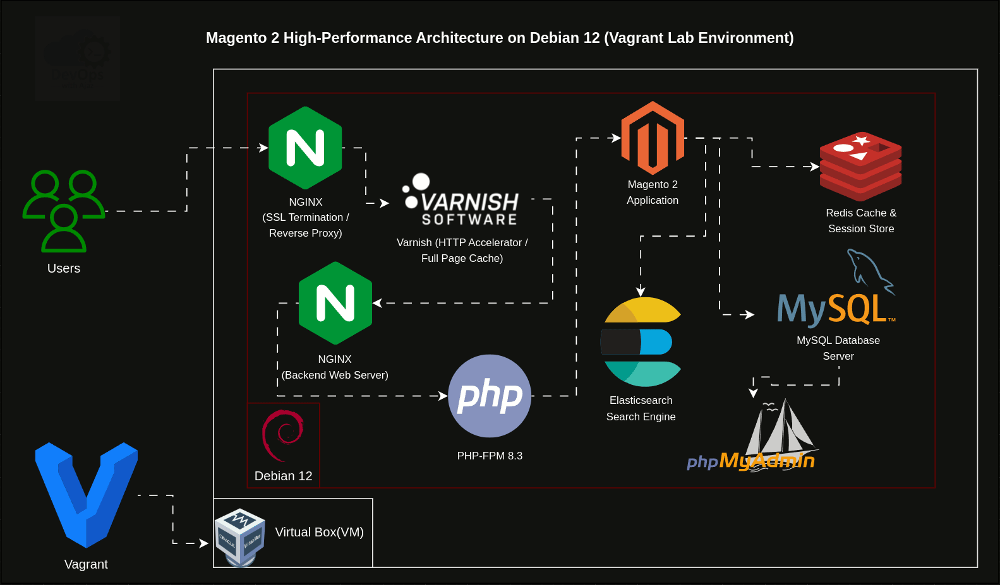
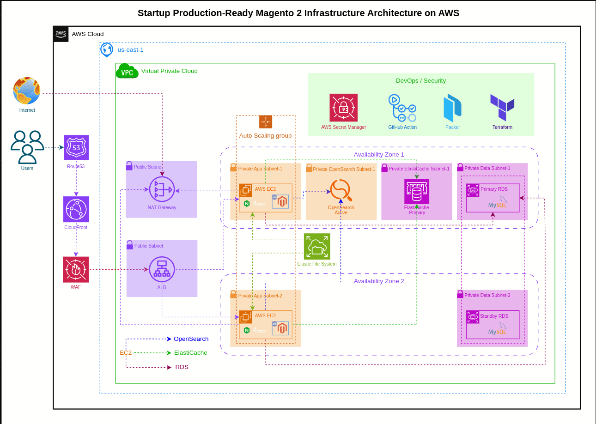
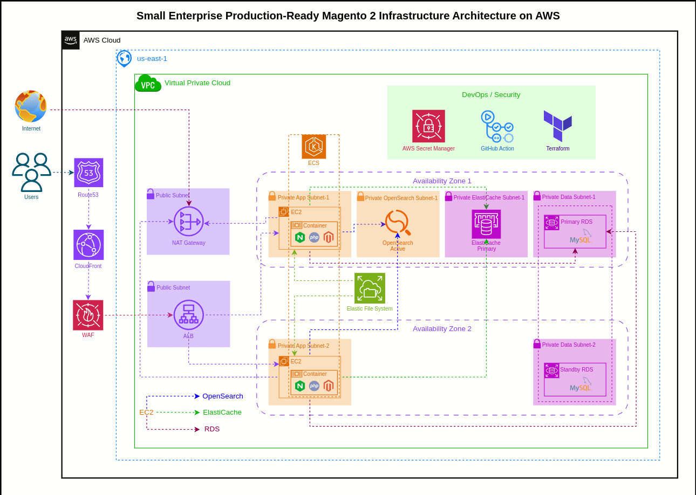
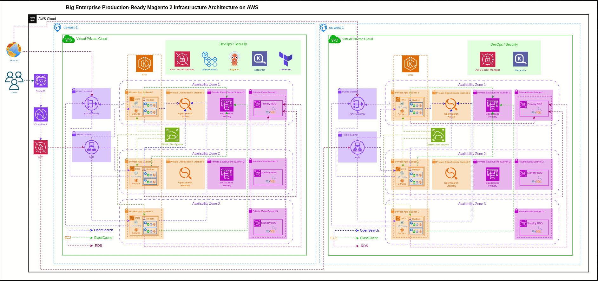
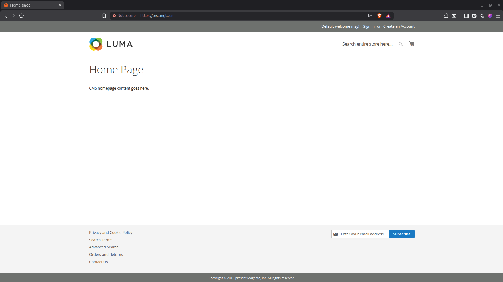
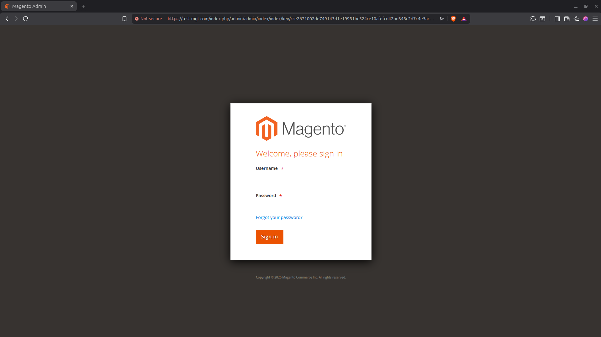
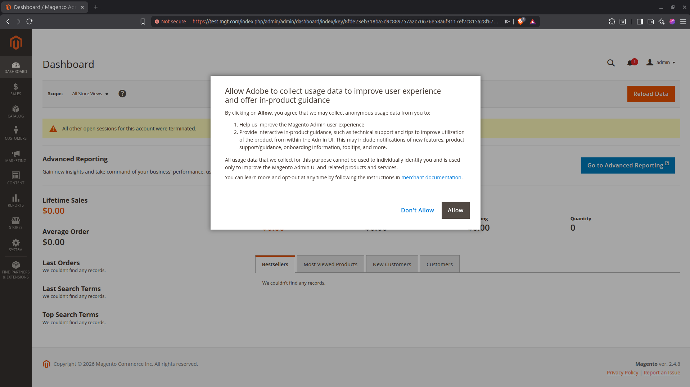
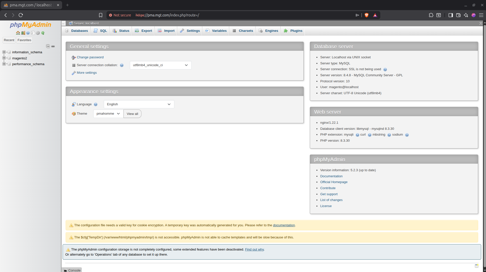
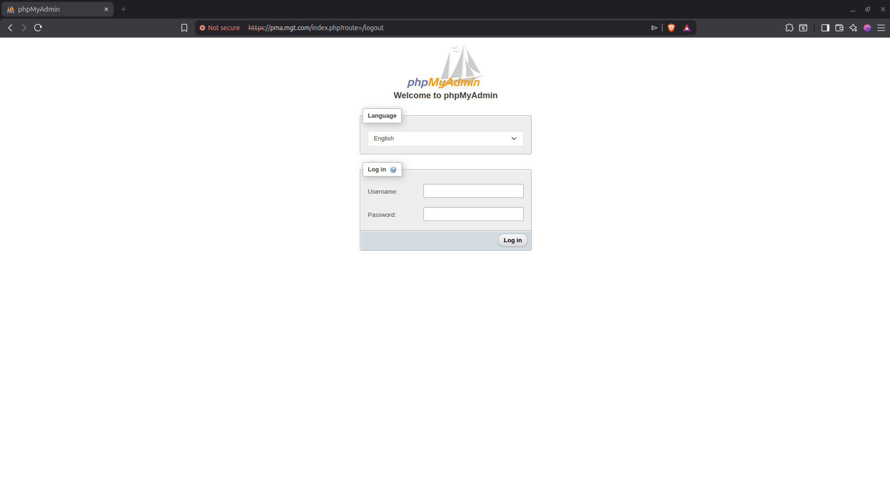

# Magento 2 Installation Lab (Vagrant + Debian 12)

A complete Magento 2 installation and configuration lab built using **Vagrant + VirtualBox** on **Debian 12**. This project demonstrates a production-like Magento stack with NGINX, PHP 8.3, MySQL 8, Elasticsearch, Redis, Varnish, HTTPS, and PHPMyAdmin.


---

## 📌 Project Overview

This lab automates the setup of a Magento 2 environment. It performs the following tasks automatically:

* Installs and configures **Nginx**, **PHP**, and **MySQL**
* Installs **Magento 2** with required dependencies
* Sets up **Redis** for caching and sessions
* Configures **Varnish** for full-page caching
* Installs and configures **phpMyAdmin**
* Generates self-signed **SSL certificates**
* Updates the system **hosts file** for local domain access
* Applies proper permissions and performance optimizations

The goal of this project is to provide a ready-to-use Magento development environment with minimal manual setup.

---

## 🧱 Architecture





---

## Install on Cloud or On-Premises (Debian 12)

If you want to install the full Magento stack on any server running **Debian 12** (cloud or on-premises), follow these steps:

Clone the repository and run the installer:

```bash
git clone https://github.com/Ajaz3800/magento2-vagrant-debian12-stack.git
cd magento2-vagrant-debian12-stack
sudo ./install_magento2.sh
```

This command will automatically install and configure the complete Magento stack.

---

## ⚙️ Requirements For Local Testing

Before starting, install the following on your host machine:

* A virtualization provider (e.g., VirtualBox)
* Vagrant
* Git
* Minimum 4 GB RAM recommended

---

## 🚀 Quick Start

### 1. Clone the Repository

```bash
git clone https://github.com/your-username/magento2-vagrant-debian12-stack.git
cd magento2-vagrant-debian12-stack
```

### 2. Start Virtual Machine

```bash
cd magento2-vagrant-debian12-stack/vagrant
vagrant up
```

### 3. SSH into VM

```bash
vagrant ssh
```

### 4. Clone repo inside vm

```bash
git clone https://github.com/your-username/magento2-vagrant-debian12-stack.git
```

### 5. Run below script

```bash
cd magento2-vagrant-debian12-stack
sudo ./install_magento2.sh
```
---

## Manual Installation (Step-by-Step)

If you prefer installing components manually, follow the scripts in this order:

### 1. Install MySQL

👉 https://github.com/Ajaz3800/magento2-vagrant-debian12-stack/tree/main/MySQL

---

### 2. Install PHP 8.3

👉 https://github.com/Ajaz3800/magento2-vagrant-debian12-stack/tree/main/php

---

### 3. Install phpMyAdmin(optional)

👉 https://github.com/Ajaz3800/magento2-vagrant-debian12-stack/tree/main/phpmyadmin

---

### 4. Install Elasticsearch

👉 https://github.com/Ajaz3800/magento2-vagrant-debian12-stack/tree/main/Elasticsearch

---

### 5. Install Redis

👉 https://github.com/Ajaz3800/magento2-vagrant-debian12-stack/tree/main/Redis

---

### 6. Install Composer

👉 https://github.com/Ajaz3800/magento2-vagrant-debian12-stack/tree/main/Composer

---

### 7. Install Magento 2

👉 https://github.com/Ajaz3800/magento2-vagrant-debian12-stack/tree/main/Magento2

---

### 8. Upadate Host File (optional)

👉 https://github.com/Ajaz3800/magento2-vagrant-debian12-stack/tree/main/etc-hosts

---

### 9. Install Nginx & Configure

👉 https://github.com/Ajaz3800/magento2-vagrant-debian12-stack/tree/main/Nginx

---

### 10. Install Varnish & Configure 

👉 https://github.com/Ajaz3800/magento2-vagrant-debian12-stack/tree/main/Varnish

---

### 11. Generate a self-signed Certificate

👉 https://github.com/Ajaz3800/magento2-vagrant-debian12-stack/tree/main/self_signed_ssl

---

Run each script with:

```bash
sudo bash script_name.sh
```

---


<!-- ## 🎥 Video Tutorial

YouTube walkthrough:

```
[Add your YouTube video link here]
```

--- -->

## 📸 Screenshots

<p align="center">
  
  
  
</p>

<p align="center">
  
  
</p>

---

## 🧪 Testing Checklist

* Magento loads over HTTPS
* Admin panel accessible
* Redis cache working
* Elasticsearch connected
* Varnish caching active
* PHPMyAdmin accessible

---

## 🐛 Troubleshooting

Common fixes:

Restart services:

```bash
sudo systemctl restart nginx
sudo systemctl restart php8.3-fpm
sudo systemctl restart mysql
sudo systemctl restart redis
sudo systemctl restart elasticsearch
```

Clear Magento cache:

```bash
php bin/magento cache:flush
```

---

## ⭐ Support

If you find this project helpful, please give it a star ⭐ on GitHub.

----

## 🌐 Connect With Me

<div align="center">
  
[](https://www.linkedin.com/in/shaikh-muhammad-ajaz)
[](mailto:shaikhajaz38000@gmail.com)
[](https://www.youtube.com/@devopswithajaz)
</div>

<div align="center">

[](https://upwork.com/freelancers/muhammadajaz)
[](https://www.fiverr.com/ajazshaikh3800)
</div>

---

<div align="center">
  
### 💡 "Turning ideas into production-ready systems."


[](https://github.com/Ajaz3800)

</div>